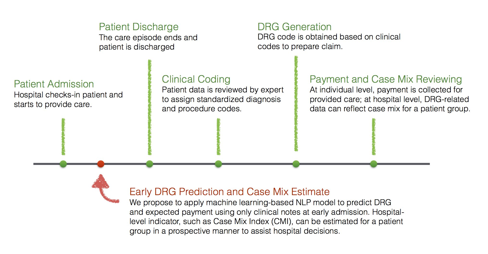

# Early DRG Prediction and Cost Estimation

<p align="center" width="100%">

</p>


This repo contains code to make early DRG prediction and cost estimation on acute inpatients using MIMIC-III. Please raise any issue if there's any question.

## Setup

The scripts in the repo were tested in Python 3.6.9, and mainly require packages including:

- numpy==1.18.1
- pandas==1.0.3
- scikit-learn==0.22.2.post1
- torch==1.4.0
- gensim==3.8.3
- nltk==3.4.5

Other versions may work as well. A full list of packages is in requirement.txt. After setting up the environment, one can edit the arguments in `option.py` or using command line to run the following codes to perform the experiments. 

## Prepare data

To create the DRG cohort for the experiments, run below. This will create cohorts for both MS-DRG and APR-DRG. 

```shell
# create cohort -- will print the cohort statistics during processing
python create_cohort.py --data_dir $DATA_PATH --mimic_dir $MIMIC_PATH --threshold 48
```

The [BioWordVec](https://github.com/ncbi-nlp/BioSentVec) word embedding is used in the experiments. After downloading it to `$EMBED_PATH`, run the line below to preprocess the notes. We also include the selected embeddings and token-to-id dictionary for the two cohorts in `data`.

```shell
# preprocessing text for MS-DRG cohort 
python preprocessing.py --data_dir $DATA_PATH --pretrained_embed_dir $EMBED_PATH --word_min_freq 3 --cohort ms

# preprocessing text for MS-DRG cohort 
python preprocessing.py --data_dir $DATA_PATH --pretrained_embed_dir $EMBED_PATH --word_min_freq 3 --cohort apr
```

## Training and Evaluation

The current experiment uses [CAML](https://github.com/jamesmullenbach/caml-mimic), an attention-based CNN model, to predict early DRG. This would require GPU resource for computation, a device can be specified in the command line. The following code can be run to load the model checkpoint provided in `checkpoints/$cohort` to evaluate on the test set. We provided two checkpoints for each cohort.

```shell
# evaluate on the MS-DRG cohort
python main.py --model CAML --single_kernel_size 5 --cnn_filter_maps 256 --cohort ms --eval_model $CHECKPOINT_PATH

# evaluate on the APR-DRG cohort
python main.py --model CAML --single_kernel_size 5 --cnn_filter_maps 256 --cohort apr --eval_model $CHECKPOINT_PATH
```

Or one can run the following commands to retrain the model and evaluate. 

```shell
# run CAML on the MS-DRG cohort
python main.py --epochs 50 --patience 10 --max_seq_length 2000 --model CAML --single_kernel_size 5 --lr 1e-4 --wd 0 --cohort ms --device 0

# run CAML on the APR-DRG cohort
python main.py --epochs 50 --patience 10 --max_seq_length 2000 --model CAML --single_kernel_size 5 --lr 1e-4 --wd 0 --cohort ms --device 0
```

## Acknowledgement

We would like to thank people who created the github repos to share the resources and code above. 
